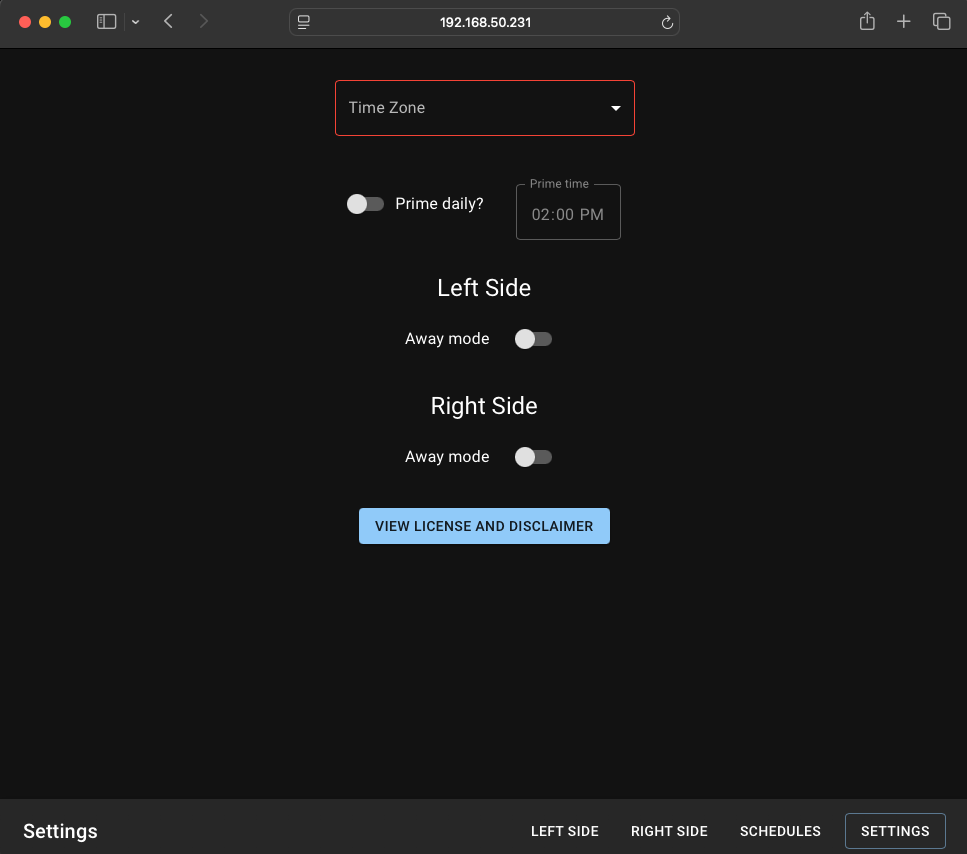

# REQUIREMENTS
## Compatability
- Pod 3 - FCC ID: 2AYXT61100001 (The FCC ID is located in the back of the pod where you plug in the water tubes)
- Currently requires you to firmware reset your pod by holding the smaller button in the back of your pod when powering up. Your device should flash green
- Pod 4

## What to do if you want to undo everything and go back to the eight sleep app
1. If you already had your pod added to your 8 sleep account in your app, go to your 8 sleep app and manage your pod, remove the pod from your account
2. [Reset the firmware again as you did here](docs/pod_teardown/10_firmware_reset.jpeg)
3. Set up the pod as a new pod in the app


### 1. Connect to device

```
minicom -b 921600 -o -D /dev/tty.usbserial-B0010NHK
```

### 2. Interrupt uboot 

You can just hit CTRL + C when you see `Hit any key to stop autoboot`


If you did it correctly, you'll see this 


### 3.Modify the boot environment, this allows us to get root access

```
# VERIFY your current_slot = a, if not, go back and firmware reset your pod
# If it's still not = a, create an issue in github 
printenv current_slot

# If you have current_slot=a
setenv bootargs "root=PARTLABEL=rootfs_a rootwait init=/bin/bash"

run bootcmd
```


### 4. Mount the file system

```
# Mount /proc for process and system information
mount -t proc proc /proc

# Mount /sys for hardware and system-level information
mount -t sysfs sysfs /sys

# Mount /dev for device files (e.g., /dev/mmcblk0)
mount -t devtmpfs devtmpfs /dev

# Mount /run (optional but useful for some runtime scripts)
mount -t tmpfs tmpfs /run

# Mount the file system in read write mode (BE CAREFUL EDITING MODIFYING FILES)
mount -o remount,rw /
```

### 5. Update password for root & rewt

```
passwd root
passwd rewt
```

### 6. Sync the file changes

```
sync
```

### 7. Reboot (DO NOT INTERRUPT BOOT THIS TIME)

```
reboot -f
```

### 8. Login as root with the password we set


### 9. Disable software updates

You may see some failures saying these services were not loaded or do not exist, that's ok
```
# Disables the software updates
systemctl disable --now swupdate-progress swupdate defibrillator eight-kernel telegraf vector frankenfirmware dac swupdate.socket

# Blocks the software updates if we ever restart or power off the device
systemctl mask swupdate-progress swupdate defibrillator eight-kernel telegraf vector frankenfirmware dac swupdate.socket
```

### 10. Setup internet access

```
# Replace WIFI_NAME and PASSWORD with your actual WiFi credentials
# (WIFI_NAME appears twice)
# 
# DO NOT USE A GUEST NETWORK OR TRY TO DO ANYTHING FANCY TO PREVENT IT FROM TALKING TO THE INTERNET
#   If you want to block internet access to the pod, we can do that with firewall rules later

nmcli connection add type wifi con-name WIFI_NAME ifname wlan0 ssid WIFI_NAME wifi-sec.key-mgmt wpa-psk wifi-sec.psk "PASSWORD" ipv4.method auto ipv6.method auto

# Reload the network manager
nmcli connection reload
```


### 11. FOR POD 4 USERS ONLY, POD 3 USERS SKIP THIS STEP
Your firmware uses a different dac.sock path location, all you need to do is run this command. This tell the free-sleep app where to establish a dac.sock connection
```
echo '/home/dac/app/sewer/dac.sock' > /home/dac/dac_sock_path.txt
```

### 12. Install the free-sleep app, this will setup a systemctl service that auto runs on boot
```
/bin/bash -c "$(curl -fsSL https://raw.githubusercontent.com/throwaway31265/free-sleep/main/scripts/install.sh)"
```


### 13. Get your pods IP address

```
# Yours will be different, that's okay
nmcli -g ip4.address device show wlan0
192.168.1.50/24
```

### 14. With a device connected to the SAME Wi-Fi network, navigate to your pod's IP address (port 3000)

SET YOUR TIME ZONE, OR ELSE SCHEDULING WILL NOT WORK! This can be done on the settings page of the web app. See screenshot below

http://192.168.1.50:3000/




### 15. Add firewall rules to block access to the internet (optional, but recommended)
```
sh /home/dac/free-sleep/scripts/block_internet_access.sh

# You can undo this with 
sh /home/dac/scripts/unblock_internet_access.sh
```


