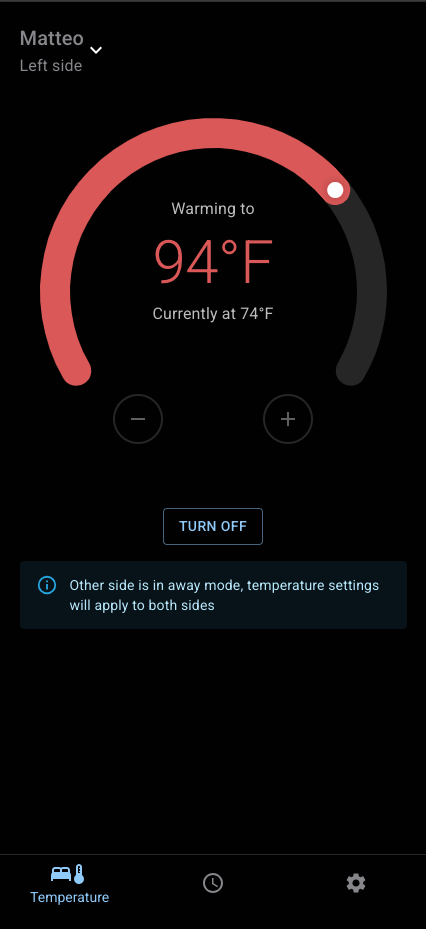
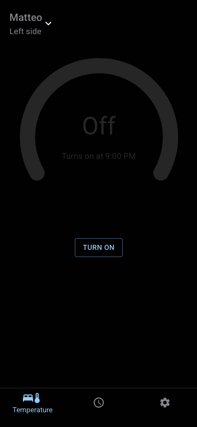
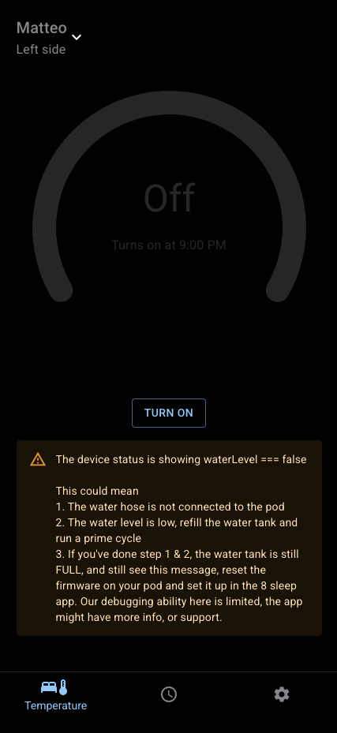
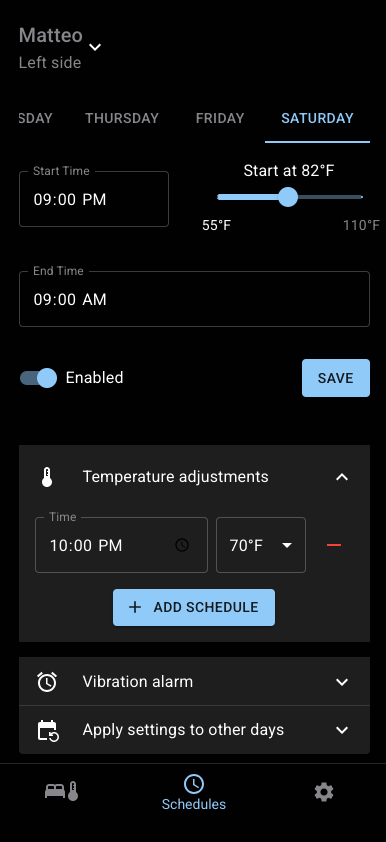

# Free Sleep: 8 Sleep Manager

## Follow us on Discord!
https://discord.gg/JpArXnBgEj
- Feature requests
- Updates
- Support

## 👉 [HOW TO INSTALL](./INSTALLATION.md) 🛠️ 👈

---  

## Is it reversible? 
Yes, I tested reversing it on my pod 3 by  [resetting the firmware](docs/pod_3_teardown/6_firmware_reset.jpeg). After the reset, setup your pod as a new pod again.

## Will I brick my pod?
Pod 3 **without** the SD card & Pod 4 are impossible to brick - _as long as you follow the directions_ 

## Tested and confirmed compatible devices
Check the back of your pod where you plug in the water tubes, 
- Pod 3 - **(With SD card) ** - _most people who have tried this gave gotten it working_
  - Follow the steps [here](https://blopker.com/writing/04-zerosleep-1/) to get root
  - Follow the [installation instructions](./INSTALLATION.md), starting from step 10 (skip step 11)
  - It's important you run step 10 ASAP, or else your pod will auto update firmware and kick you out
- Pod 3 - **(No SD card)** - FCC ID: 2AYXT61100001 
- Pod 4

## Features
- Allows complete control of device WITHOUT requiring internet access. If you lose internet, your pod WILL NOT turn off, it will continue working! You can completely block WAN internet access if you'd like too. (I blocked all internet access from my pod on my router...)
- WARNING: This will bypass blocked devices, please use responsibly
- Dynamic temperature control with real-time updates
- Schedule management: 
  - Set power on/off times 
  - Schedule temperature adjustments
  - Schedule daily time to prime the pod
  - Alarms - If you turn off the Pod prior to the alarm running, then the alarm will not run
- Settings customization: Configure timezones, away mode, brightness of LED on pod
- Website works on desktop and mobile

### Biometrics 📈
- **The only biometrics data that has been validated is heart rate**, HRV & breathing rates have not been validated & may be inaccurate.
Heart rates were validated over 33 sleep periods from 3 males & 3 females against mostly Apple Watches. 
**Heart rate calculations tend to be slightly less accurate for females**
- Summary statistics for all 33 periods:
  - RMSE - 2.88 average, 1.45 min, 7.63 max 
  - Correlation - 80.8% average, 27% min, 95% max
  - MAE - 1.83 average, 1 min, 5.77 max
- How to enable:
  - `sh /home/dac/free-sleep/scripts/enable_biometrics.sh`
- How to disable:
  - `sh /home/dac/free-sleep/scripts/disable_biometrics.sh`

#### Biometrics Overview

All biometric and sleep data is inserted into SQLite @ `/persistent/free-sleep-data/free-sleep.db`.

1. Vitals (Heart rate, breath rate, HRV) `biometrics/stream/stream.py` - This runs 24/7 and calculates vitals when it detects presence.
Vitals are inserted once every 60 seconds & you can access the raw data @ <POD_IP>/api/metrics/vitals
**Data will not show in the UI if you don't have scheduled on/off times and daily primes enabled**

2. Sleep periods `biometrics/sleep_detection/analyze_sleep.py` - This is scheduled under `server/src/jobs/jobScheduler.ts`
DEPENDS ON:
- Scheduled on/off times
  - The sleep period is only calculated whenever the pod is scheduled to turn off on a side for that day
- Daily priming enabled (this should be during a period no one is ever present on the pod)
  - This establishes a base level threshold in order to detect when a user is present

## Limitations
- Requires your device to be on the same Wi-Fi as the pod
- No authentication is implemented
- Does not have sleep statistics available (HRV, hear rate, REM time, snore time, etc.), this is a WIP
- Pod 4 taps do not work

--- 

## Overview
Free Sleep is an open-source project designed to control and manage temperature schedules and settings for a device locally. It includes:
- **Server**: A backend that interacts with the device through custom APIs.
- **App**: A frontend React application for user-friendly interaction with the device.

This project is intended to be entirely ran on an 8 sleep pod

---

### **Server**
- REST API for managing device settings, schedules, and status.
- Modular design with routes for `deviceStatus`, `settings`, `schedules`, and `execute`.
- Uses Node.js and Express for lightweight, fast operations.

---

## Tech Stack
- **Server**: Node.js, Express, TypeScript.
- **App**: React, Material-UI, Zustand, React Query.
- **Database**: LowDB for simple JSON-based storage.

---

## App screenshots

## Contributing

- Reach out to me on Discord @free_sleep to coordinate work so we don't step on each other's toes
- Make sure you run `npm run lint` in `server/` & `app/`
- Your changes must not have any conflicts with the main branch, I don't have the bandwidth to fix your git conflicts
- Changes must be in TS

---

## Support

If you find this project helpful and would like to support its continued development, you can send a tip to my Bitcoin address.   

BTC Address:
bc1qjapkufh65gs68v2mkvrzq2ney3vnvv87jdxxg6

Thank you for your support!
